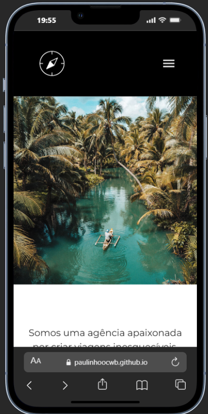

# 🌎 Jornada Viagens

**Jornada Viagens** é um site fictício de agência de viagens, desenvolvido apenas com **HTML e CSS**, com foco em **layout, responsividade e boas práticas de Git**.  

Este projeto faz parte do **Plano de Carreira de Desenvolvimento Web da Alura**, como prática aplicada dos estudos de front-end.

---

## 💻 Tecnologias utilizadas

- HTML5  
- CSS3 (Flexbox e Grid)  
- Estrutura modular de CSS via `@import url()`  
- Deploy via GitHub Pages

---

## 📱 Funcionalidades

- Layout responsivo para mobile e desktop  
- Menu de navegação funcional  
- Sessões de ofertas e destinos populares  
- Busca por categoria de viagens  
- Depoimentos e rodapé com informações de contato  
- Estrutura limpa e organizada, pronta para portfólio  

---

## 🌐 Link do projeto

Acesse o site online no GitHub Pages:

[https://paulinhoocwb.github.io/jornada-viagens/](https://paulinhoocwb.github.io/jornada-viagens/)

---

## 🏗 Estrutura do projeto
jornada-viagens/
├─ index.html
├─ pacote-de-viaens.html
├─ favicon.svg
├─ css/
│ ├─ categories.css
│ ├─ destinations.css
│ ├─ footer.css
│ ├─ global.css
│ ├─ header.css
│ ├─ hero.css
│ ├─ offers.css
│ ├─ payments.css
│ ├─ style.css # Importa todos os outros CSS via @import url()
│ └─ testimonials.css
├─ fonts/
│ └─ ... (fontes usadas)
└─ img/
└─ ... (imagens e ícones)

---

## 🖼 Captura de tela

  

---

## 🚀 Observações

- Projeto criado apenas com HTML e CSS, sem frameworks ou JS  
- Estrutura modular de CSS usando `@import url()` para organizar estilos  
- Objetivo: demonstrar habilidades de layout, responsividade e boas práticas de Git  
- Deploy feito via GitHub Pages  
- Parte do estudo do **Plano de Carreira de Desenvolvimento Web da Alura**
